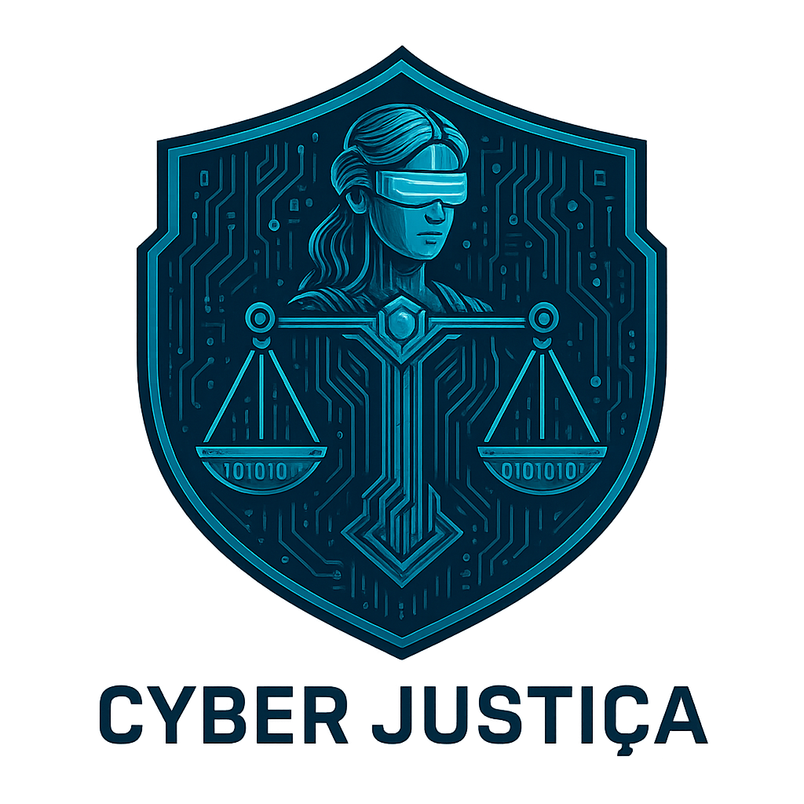

<div align="center">



# CyberJustiça Brasil

### Cybercrime stories, specialist perspectives and digital-safety education

[](https://v0-cyber-justica.vercel.app)
[](https://nextjs.org/)
[](LICENSE)
[](https://github.com/Samurai33/CyberJust/actions/workflows/ci.yml)

[](https://github.com/Samurai33/CyberJust/issues)
[](https://github.com/Samurai33/CyberJust/pulls)
[](https://github.com/Samurai33/CyberJust/commits/main)
[](CONTRIBUTING.md)

</div>

## Overview

CyberJustiça Brasil is a responsive media and education experience that presents
Brazilian cybercrime cases, protection guidance, specialist profiles and
audio-first storytelling through a cybersecurity-inspired interface.

The repository demonstrates product design and front-end engineering. It is not a
law-enforcement system, forensic platform or source of legal advice.

## Experience highlights

- Cybercrime case and episode presentation
- Audio player with bookmarks and transcript-oriented UI
- Specialist, project, resource and timeline views
- Digital-protection educational content
- Responsive cyberpunk interface
- Server-verified dashboard access, accessible (Radix-based) UI components
- Structured content backed by local data and services

## Technology

`Next.js 16` · `React 19` · `TypeScript` · `Tailwind CSS` · `Radix UI` ·
`Recharts` · `React Hook Form` · `Zod` · `Vitest`

## Getting started

### Prerequisites

- Node.js ≥ 22
- [pnpm](https://pnpm.io/) 10.12.4 (declared in `package.json#packageManager`)

### Install and run

```bash
git clone https://github.com/Samurai33/CyberJust.git
cd CyberJust
pnpm install
```

The internal dashboard (behind the logo click / auth modal) requires two
environment variables. Copy the template and fill in real values — see
[`.env.example`](.env.example) for how to generate the session secret:

```bash
cp .env.example .env.local
```

```bash
pnpm dev
```

Open [http://localhost:3000](http://localhost:3000).

### Production build

```bash
pnpm build
pnpm start
```

### Testing and type-checking

```bash
pnpm type-check   # tsc --noEmit
pnpm test         # vitest run
```

Both run in CI (`.github/workflows/ci.yml`) on every push and pull request to
`main`, alongside `pnpm build`.

## Project boundaries

- Public content should be treated as educational and editorial.
- Claims and case material require source verification before publication.
- Authentication and dashboard interactions are prototype capabilities unless
  explicitly connected to production services.
- Do not submit sensitive personal, investigative or evidentiary data.

## Community and security

- [Contributing guide](CONTRIBUTING.md)
- [Security policy](SECURITY.md) — please report vulnerabilities privately, not via public issues
- [Code of conduct](CODE_OF_CONDUCT.md)
- [Open issues](https://github.com/Samurai33/CyberJust/issues) · [Open pull requests](https://github.com/Samurai33/CyberJust/pulls)

## License

Released under the [MIT License](LICENSE).
